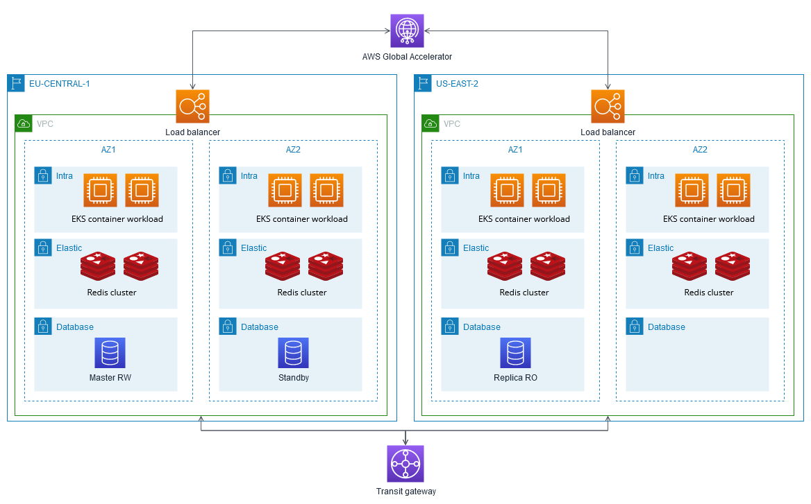

## POC of AWS highly available configuration deployed with one command

### Architecture

* Multiple AWS availability zones
* AWS Global Accelerator
* Multiple EKS clusters
* Ready to deploy three-tiered application

This is NOT a production ready solution, but PoC made for research purposes.



### Deploy infrastructure

```
export AWS_PROFILE=<profile_name>
cd terraform
make create-all
```

Deployment will take from 40 to 60 minutes.

### Deploy application

You can use for example GitHub Actions to deploy:

1. Create github repository
2. run `make show-creds` to get id and access key for the deployer role
3. Put key id into `AWS_ACCESS_KEY_ID` repository secret (Settings - Secrets and variables - Actions)
4. Put secret into `AWS_SECRET_ACCESS_KEY` repository secret (Settings - Secrets and variables - Actions)
5. Use GitHub Actions workflow from the app/ folder to deploy application in EKS clusters

### Cleanup

```
export AWS_PROFILE=<profile_name>
cd terraform
make destroy-all
```

The cleanup will take from 20 to 30 mins.

